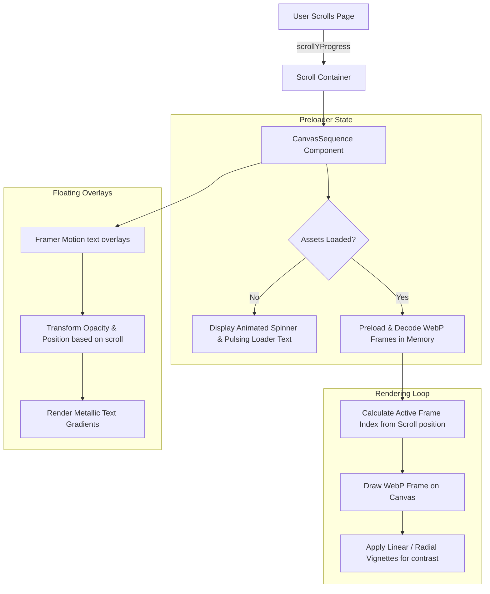

# 🏆 Haute Horlogerie | Luxury Watch Showcase

An ultra-premium, interactive digital experience showcasing two of the world's most sophisticated mechanical timepieces: the **Jacob & Co. Bugatti Chiron Tourbillon Rose Gold** and the **Louis Moinet Memoris 18K Red Gold**. 

Built with **Next.js**, **Tailwind CSS**, and **Framer Motion**, the application features highly optimized, scroll-linked 3D canvas sequences that dismantle and assemble the watches interactively as the user scrolls.

---

## ✨ Live Experience Features

*   🌌 **Cinematic Radial Gradients**: Dynamic backdrops that simulate soft, warm rose-gold ambient lighting in a high-end darkroom.
*   💫 **Framer Motion Scroll-linked Timelines**: Watch components slide, float, and lock into place relative to the user's scroll depth.
*   💎 **Advanced Micro-Animations**:
    *   **Logo Shimmer**: The main logotype reflects light on hover using metallic text gradients.
    *   **Interactive Specs Cards**: Frosted glassmorphism panels (`backdrop-blur-md`) that react to cursor hovers with light-reflection borders and left-aligned accent sweeps.
    *   **Reflection Sweep Button**: The CTAs have a custom diagonal shimmer beam that sweeps across the button when hovered.
*   🖼️ **High-Performance Canvas Sequences**: Raw PNG sequences optimized to lightweight WebP formats, utilizing an asynchronous HTML5 Canvas preloader that renders frames seamlessly without lag.
*   ⏳ **Dynamic Asset Loader**: Prevent flashing or black screen layouts during loading with an animated, pulsing sequence loader.
*   👁️ **Vignette Contrast Layers**: Custom radial and linear dark overlays ensure typography remains readable over complicated skeleton movements.

---

## ⌚ The Timepieces

### 1. Jacob & Co. Bugatti Chiron Tourbillon Rose Gold
*   **The Engine**: A miniature, working Bugatti W16 engine block sits inside the case. Pushing the right crown moves the pistons up and down while two turbochargers spin.
*   **Case Material**: 18K Rose Gold, featuring a highly-domed sapphire crystal back and front.
*   **Movement**: JCAM37 Manual winding skeletonized movement with 578 components and a 60-hour power reserve.

### 2. Louis Moinet Memoris 18K Red Gold (LM-79.50.15)
*   **The Concept**: The world's first chronograph watch where the entire mechanism is fully visible on the dial-side, rather than hidden on the back.
*   **Exclusivity**: Strictly limited edition of **only 12 watches** worldwide.
*   **Material**: 18K Red Gold (a deeper, warmer variant of gold).

---

## 🛠️ Architecture & Flow Map

The interactive scroll experience is divided into three key stages linked to the window's scroll position. Below is the system flow map:



---

## 💻 Tech Stack

*   **Framework**: Next.js 15+ (App Router)
*   **Core Logic**: React 19 (Client Components)
*   **Animations**: Framer Motion 11
*   **Styling**: Tailwind CSS v4 (with custom `@theme` utilities)
*   **Graphics**: HTML5 2D Canvas Context API

---

## ⚙️ Development & Setup

### Prerequisites
Make sure you have Node.js installed on your machine.

### Installation
1. Clone the repository:
   ```bash
   git clone https://github.com/Prem759-0/Movement-Watch.git
   cd Movement-Watch
   ```
2. Install dependencies:
   ```bash
   npm install
   ```
3. Run the development server:
   ```bash
   npm run dev
   ```
   Open [http://localhost:3000](http://localhost:3000) to view it in the browser.

### Asset Optimization (WebP Conversion)
The frame animations are highly compressed using WebP compression script `compress.mjs` to keep build sizes light and fast on Vercel:
```bash
node compress.mjs
```

---

## 🚀 Deployment

The site is configured for production deployment on **Vercel** with automatic caching rules for WebP frames.

*   Every commit pushed to the `main` branch on GitHub triggers an automatic deployment.
*   Includes `suppressHydrationWarning` on the root node layout to bypass standard hydration conflicts caused by browser extensions (e.g. ColorZilla, Grammarly).
